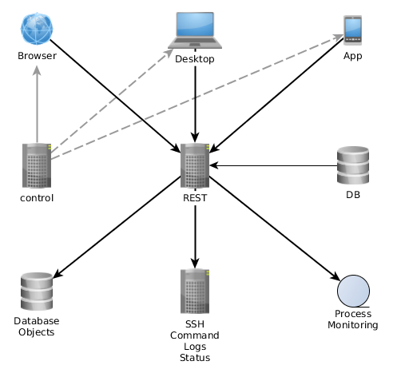

# Alinex Operator

[](
  https://github.com/alinex/node-operator/subscription)<!-- {.hidden-small} -->
[](
  https://github.com/alinex/node-operator)
[](
  https://github.com/alinex/node-operator)<!-- {.hidden-small} -->
<!-- {p:.right} -->

[](
  https://www.npmjs.com/package/alinex-operator)
[](
  #license)<!-- {.hidden-small} -->
[](
  https://travis-ci.org/alinex/node-operator)
[](
  https://gemnasium.com/alinex/node-operator)
[](
  https://github.com/alinex/node-operator/issues)<!-- {.hidden-small} -->

The operator application is a front-end to manage complex IT structures. It displays
the complete structure in an object oriented way while objects may be:
- database objects
- systems
- processes with their logs

These operation objects maybe linked with each other and are allowed to:
- be searched for
- display with their data
- start actions on them
- monitor them

In the end it gives you the ability to click your way through all your systems and
data within some mouse clicks in your browser.

## Architecture

The IT Operator consists of two parts, the [Control](https://github.com/alinex/node-control)
and the [REST](https://github.com/alinex/node-rest) servers.



The [Control](https://github.com/alinex/node-control) server delivers a web application
and builds the desktop and mobile apps to be used. They are all the same on different
devices. They all contact and get their data from the central
[REST](https://github.com/alinex/node-rest) servers which may be load balanced and
clustered for high scalability.

### Components

REST Server (default)
- Port 1974
- HTTPS

Control Server (default)
- Port 2301
- HTTPS

## Usage

**In the moment this is in heavy development and not really ready for productive use.**

The Operator contains both, the Control and REST server, so you may start one or
the other and maybe also both on one server.

### Installation

For easy and fast handling use yarn:

``` bash
# Install yarn package manager
$ sudo npm install -g yarn
# Install the operator
$ yarn global add https://github.com/alinex/node-operator
```

Now you may start it:
``` bash
$ yarn control  # Start control server
$ yarn rest     # Start rest server
$ yarn start    # Start both servers
```

### Development

For development you should clone from github and install:

``` bash
# Install yarn package manager
$ git clone https://github.com/alinex/node-operator
# Install the modules
$ yarn
```

Now you may run the development version with hot reloading:

``` bash
# Start both server
$ yarn dev
```

You may also run each of them individually in their modules.

## License

(C) Copyright 2017 Alexander Schilling

Licensed under the Apache License, Version 2.0 (the "License");
you may not use this file except in compliance with the License.
You may obtain a copy of the License at

>  <https://www.apache.org/licenses/LICENSE-2.0>

Unless required by applicable law or agreed to in writing, software
distributed under the License is distributed on an "AS IS" BASIS,
WITHOUT WARRANTIES OR CONDITIONS OF ANY KIND, either express or implied.
See the License for the specific language governing permissions and
limitations under the License.
