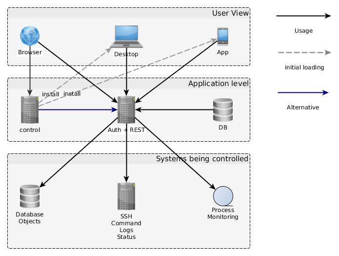

# Architecture

The IT Operator consists of two parts, the [Control](https://github.com/alinex/node-control)
and the [REST](https://github.com/alinex/node-rest) servers.

The [Control](https://github.com/alinex/node-control) server delivers a web application
and builds the desktop and mobile apps to be used. They are all the same on different
devices. They all contact and get their data from the central
[REST](https://github.com/alinex/node-rest) servers which may be load balanced and
clustered for high scalability.

## Components

The components displayed may be configured to your needs.

__Control Server + Application Builder__

- Server which runs the application
- Code base for mobile Apps
- Code base for Desktop Applications

Read more in the [Control App book](https://alinex.gitbooks.io/control)

__REST Server__

- Authentication and Authorization Server
- Data Retrieval Point
- Processing Machine

Read more in the [REST Server book](https://alinex.gitbooks.io/rest)

__Data Store__

- Persistent store for the REST Server
- User Profiles with Settings
- Roles and rights

This is also documented in the [REST Server book](https://alinex.gitbooks.io/rest)
